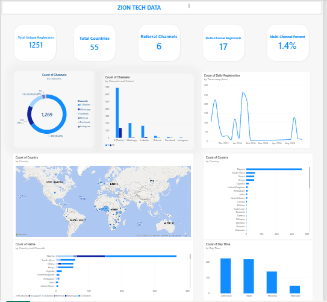
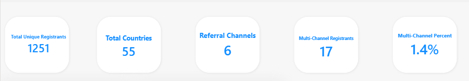

# Zion TechHub Data Challenge — Cohort 9 & 10 Registration Analysis

A full data-cleaning-to-dashboard pipeline built on two messy, real-world Google Form exports, answering three business questions: where ad budget should go, how to grow the community, and where to expand internationally.

**Tech stack:** Python (pandas) · Power BI · Excel

---

## Table of Contents

- [Overview](#overview)
- [The Challenge](#the-challenge)
- [Dataset](#dataset)
- [Repository Structure](#repository-structure)
- [Data Cleaning Pipeline](#data-cleaning-pipeline)
- [Key Findings](#key-findings)
- [Results Summary](#results-summary)
- [Dashboard](#dashboard)
- [Assumptions & Limitations](#assumptions--limitations)
- [How to Reproduce](#how-to-reproduce)
- [Full Write-up](#full-write-up)

---

## Overview

Zion TechHub provided two raw registration datasets (Cohort 9 and Cohort 10) and asked for a data-driven answer to three questions:

1. Where should ad budget go, and on whom?
2. What else should be done to grow the community?
3. Where should Zion TechHub grow organically outside Nigeria?

This repo contains the full pipeline: raw data → Python cleaning → merged/deduplicated dataset → Power BI dashboard → written recommendations.

## The Challenge

The source data was deliberately messy, and two fields — **Phone Number** and **Email Address** — had been de-identified in a way that made them unreliable as standalone unique identifiers (see [Key Findings](#key-findings)). Solving for this shaped the entire cleaning and deduplication approach documented here.

## Dataset

| | Cohort 9 | Cohort 10 |
|---|---|---|
| Raw rows | 1,147 | 171 |
| Occupation field | Not collected | Collected |
| Amount Paid field | Withheld by organizers | Withheld by organizers |
| Source | Google Form export (.xlsx) | Google Form export (.xlsx) |

> Raw data files are not included in this repo out of respect for registrant privacy. Cleaned, de-identified outputs are included under `/data/processed/`.

## Repository Structure

```
├── notebooks/
│   ├── cohort9_cleaning.ipynb      # Cohort 9 cleaning, field by field
│   ├── cohort10_cleaning.ipynb     # Cohort 10 cleaning, field by field
│   └── Appending_script.ipynb        # Merge, deduplication, channel logic
├── data/
|    ├── cleaned/
│         ├── cohort9_cleaned.xlsx      # cleaned cohort 9  data
│         └── cohor10_cleaned.xlsx      # cleaned cohort 10  data
│         └── combined_cleaned.xlsx     # cohort 9 and 10 columns combined 
|    ├── processed/
|         └── final_analysis.xlsx  # Final cleaned, analysis-ready dataset
|    ├── raw/
│         ├── cohort 9.0 (Responses.xlsx)      # raw cohort 9 response data
│         └── cohort 10.0 Registration.xlsx     # raw cohort 10 response data
├── dashboard/
│   # Power BI dashboard page exports
└── README.md
```

## Data Cleaning Pipeline

Each cohort was cleaned independently in its own notebook before merging, so every anomaly could be traced back to its source file.

| Field | Treatment |
|---|---|
| **Timestamp** | Converted to real datetime; derived `Day Time` bucket (Midnight/Morning/Afternoon/Night) |
| **Name** | Trimmed, title-cased; 55 blank values (Cohort 9) filled from email prefix, flagged via `name_from_email` |
| **Email Address** | Trimmed, lowercased — found to be truncated at source (see below) |
| **Phone Number** | Stripped to digits only, no fixed length enforced — found to be truncated at source |
| **Country** | Trimmed, title-cased, mapped via lookup table; ambiguous values cross-referenced against phone country codes |
| **Gender** | Trimmed, title-cased — already clean (3 values) |
| **Course / Occupation** | Trimmed, title-cased; Occupation only present in Cohort 10 |
| **Referral Source (Channel)** | Trimmed, title-cased; `Whatsapp Community` merged into `Whatsapp` — 6 final channels |

## Key Findings

### 1. Phone Number and Email Address were de-identified via truncation

Both fields had real values replaced before the data was shared, while original formatting/length was preserved. This meant:
- Phone numbers ranged from 3–13+ digits with no consistent length
- Email local-parts were truncated to ~4 characters (`abdu@gmail.com` was shared by 19 unrelated people with similarly-spelled names)

**Consequence:** neither field could be used alone as a duplicate-detection key. An email-only duplicate check returned 308 false-positive "duplicates" out of 1,318 rows.

### 2. Duplicate detection via combined-field matching

Switched to requiring agreement across **Name + Email Address + Country** simultaneously. This flagged 126 rows as genuine duplicates, collapsing the dataset from 1,318 → **1,251 unique registrants**.

### 3. Multi-channel registrant behavior

A set of 6 boolean columns (one per channel) was built and combined per unique person via `groupby(...).any()`, preserving full channel history even after deduplication. **17 registrants (~1.4%)** engaged through more than one channel — most commonly X (Twitter) + WhatsApp or a personal Referral.

## Results Summary

| Metric | Value |
|---|---|
| Total raw registrations | 1,318 |
| Unique registrants after dedup | 1,251 |
| Duplicate rows removed | 67 |
| Multi-channel registrants | 17 (~1.4%) |
| Top channel | X (Twitter) — ~66% of registrations |
| Top international countries | South Africa, Ghana, Kenya, Uganda |
| Peak registration window | Afternoon–Night (12pm–11pm), ~70% of all registrations |

### Recommendations

- **Budget:** prioritize X (Twitter) for acquisition; allocate a secondary share to WhatsApp as a nurture channel
- **Growth:** concentrate ad delivery and content pushes in the 12pm–11pm window; build a Twitter → WhatsApp two-stage funnel
- **Geography:** prioritize organic growth in South Africa, Ghana, and Kenya

Full reasoning and supporting numbers for each recommendation are in [`reports/medium_article.md`](reports/medium_article.md).

## Dashboard Preview





Built in Power BI across 8 chart visualizations: Overview (KPIs), Channel & Budget, Growth & Timing, Geography. Screenshots available under `/dashboards`.

*(Live Power BI link not available — this project was built without an organizational Power BI account, so results are shared as static exports and a written report instead.)*

## Assumptions & Limitations

- `Amount Paid` was not provided in either source file — no revenue-per-channel analysis was possible
- 55 Cohort 9 names were derived from email prefixes, not self-reported, and are flagged accordingly
- Occupation data exists only for Cohort 10
- 4 Country values remained genuinely ambiguous even after phone-code cross-referencing, and are labeled `Unknown/Unclear`
- Duplicate detection is based on combined-field matching rather than a single unique ID, due to source-data de-identification — a small residual risk of false positives/negatives remains

## How to Reproduce

```bash
# clone the repo
git clone https://github.com/Ranky13/zion-tech-data-challenge.git
cd zion challenge

# set up environment
python -m venv venv
source venv/bin/activate   # venv\Scripts\Activate.ps1 on Windows
pip install pandas numpy matplotlib seaborn openpyxl jupyter ipykernel

# run notebooks in order
jupyter notebook notebooks/01_cohort9_cleaning.ipynb
jupyter notebook notebooks/02_cohort10_cleaning.ipynb
jupyter notebook notebooks/03_merge_analysis.ipynb
```

Raw source files are not included; place your own Cohort 9/10 exports under `data/raw/` before running.

## Full Write-up

The complete narrative — every cleaning decision, the de-identification findings, and detailed answers to all three challenge questions — is available in [`reports/medium_article.md`](reports/medium_article.md), also published on Medium: *[link]*.

---

**Author:** Rokeeb Bashir
**Challenge:** Zion TechHub Data Challenge
